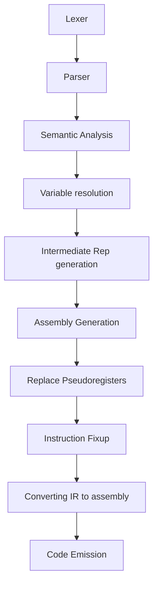

# CCompiler
A basic C compiler to learn about compilation

The current pipeline is:

```mermaid
flowchart TD
    A[Lexer]
    
    B[Parser]
    
    C[Semantic Analysis]
    C1[Variable resolution]
    C --> C1
    
    D[Intermediate Rep generation]
    
    E[Assembly Generation]
    E1[Replace Pseudoregisters]
    E2[Instruction Fixup]
    E3[Converting IR to assembly]
    E --> E1
    E1 --> E2
    E2 --> E3
    
    F[Code Emission]
    
    A --> B
    B --> C
    C1 --> D
    D --> E
    E3 --> F
```
